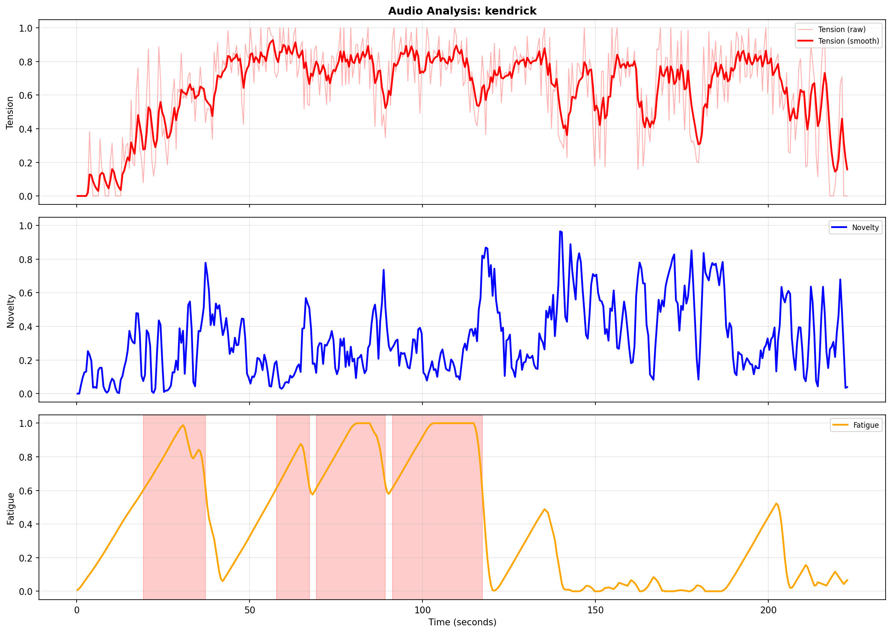

# director-signals

A deterministic, offline audio analysis system for modelling long-horizon musical structure
(tension, novelty, fatigue, and impact) using explainable signal processing — no machine learning.

This repository contains a **Python reference implementation** used to prototype and inspect
the core signal-processing ideas behind *The Director*. It exists to make the signals
reproducible, inspectable, and open to critique.

## Overview

The system ingests full audio tracks and produces:

- **Perceptual curves**: tension / energy, novelty, repetition / fatigue, drop impact
- **Detected events**: candidate drops, stagnant sections, transition boundaries
- **Evaluation outputs**: interpretable JSON + visualisations

All algorithms are deterministic, explainable, and reproducible.
The same input will always produce the same output.

This code is **not** a real-time engine or DAW plugin. It is a research and prototyping artefact.

## Why

Hey, I love music. All kinds. But I'm sitting there one day and Beyoncé's *Haunted* comes on. Not my usual tipple.

I've never spent time listening to Beyoncé before. I sat there, listening — if you've not heard the track, go listen. The journey is wild. I cannot describe the emotions I endured during the first playback.

I wanted to work out WHY it had such an impact on me, and as a man of the Internet, I decided it would be fun to try it with some engineering. And here we are.

## Design Principles

- **No ML / AI** — pure signal processing and heuristic rules
- **Deterministic** — no randomness, no training data
- **Explainable** — every curve and event is traceable to inputs
- **Long-horizon** — minutes-scale structure, not frame-level effects
- **Testable** — complete synthetic test suite, no external audio required

## Example Output



The system produces three time-aligned curves:

- **Tension** (red): Perceived intensity combining loudness, rhythm density, and spectral features
- **Novelty** (blue): Degree of change relative to recent context — spikes at transitions
- **Fatigue** (orange): Accumulated repetition — shaded regions indicate detected stagnant sections

```json
{
  "schema_version": "1.1.0",
  "duration_sec": 223.19,
  "top_tension_peak": {
    "time_sec": 56.75,
    "value": 0.927
  },
  "num_candidate_drops": 0,
  "num_stagnant_segments": 4,
  "longest_stagnant_duration_sec": 26.0
}
```

### Example Outputs

Full example outputs from synthetic test tracks:

- [build_drop](docs/examples/build_drop/) — rising tension followed by energy release
- [contrast](docs/examples/contrast/) — quiet vs loud section transitions
- [repetitive_loop](docs/examples/repetitive_loop/) — sustained repetition triggering fatigue

## Quick Start

### Installation

```bash
pip install -r requirements.txt
```

### Basic Usage

```bash
# Run demo mode (no audio files needed)
python cli.py --demo --output demo_output/

# Analyse a single track
python cli.py track.wav --output results/

# Analyse all files in a directory
python cli.py tracks/ --output results/

# Verbose output
python cli.py track.wav --output results/ --verbose
```

### Running Tests

```bash
pytest tests/ -v
```

## Output Structure

For each analysed track:

```
output_dir/track_name/
├── track_name_metrics.json
├── track_name_summary.json
├── track_name_segments.json
├── track_name_plots.png
└── track_name_tension_components.png
```

## Core Concepts

### Time Scales

- **Frame**: short STFT window (2048 samples ≈ 93 ms @ 22050 Hz)
- **Block**: musically meaningful aggregation (0.5 s default)
- **Long-horizon**: minutes-scale analysis over block sequences

### Curves

1. **Tension / Energy**
   Composite measure of perceived intensity (RMS, onset density, spectral features).

2. **Novelty**
   Degree of change relative to recent context; highlights transitions and violations.

3. **Fatigue**
   Sustained predictability and low variance; highlights stagnation and over-looping.

4. **Drop Impact**
   Contrast between pre-drop build and post-drop energy persistence.

## Architecture

```
config.py          → Parameters and constants
src/
  audio_io.py      → Audio loading and preprocessing
  features.py      → Frame-level feature extraction
  aggregation.py   → Block aggregation and smoothing
  metrics.py       → Long-horizon curve computation
  events.py        → Event detection heuristics
  export.py        → JSON and plot generation
cli.py             → Command-line interface
tests/
  test_synthetic.py → Synthetic ground-truth tests
```

## C++ Implementation (Phase 2)

A production C++ implementation exists as a real-time DAW plugin, built with the [JUCE](https://juce.com/) framework.


### Relationship to This Repository

This Python codebase (Phase 1) serves as the **reference implementation** for algorithm development and validation. The C++ version (Phase 2) is a performance-optimised port designed for real-time use in digital audio workstations.

### Parity Guarantees

Both implementations produce **numerically identical outputs** for the same input audio:

- **Resampling**: Linear interpolation (`res_type='linear'` / `juce::LinearInterpolator`)
- **Timebase**: Canonical block count with ceil-based output length calculation
- **DSP Kernel**: Identical algorithms for tension, novelty, and fatigue curves

Golden outputs generated by this Python implementation are used to validate the C++ port.

### Version Tracking

Outputs include version identifiers to ensure reproducibility:

```json
{
  "kernel_version": "1.2.0",
  "timebase_version": "1",
  "schema_version": "1.1.0"
}
```

Bump `kernel_version` when DSP logic changes; bump `timebase_version` when block/time calculations change.

### C++ Features

- Real-time analysis in VST3/AU plugin format
- Low-latency processing suitable for live mixing
- Native performance on macOS and Windows

---

## Theoretical Context

After this system was built, its behaviour was found to closely align with
David Huron’s **ITPRA** framework (Imagination–Tension–Prediction–Reaction–Appraisal)
described in *Sweet Anticipation*.

This project does **not** claim to validate or prove the theory.
It represents an independent operationalisation that appears consistent with it.

You can find chapter one here:

https://www.researchgate.net/publication/209436188_Sweet_Anticipation_Music_and_the_Psychology_of_Expectation

I decided to email David to say thank you, only to realise he'd left the planet for a better place. 

Therefore, **v1.0 is dedicated to the memory of David Huron.**

## Limitations

- Offline analysis only
- No real-time processing or DAW integration
- No machine learning
- Fixed block duration (no BPM inference)

## License

MIT

## Contact

Issues and discussion via GitHub.

